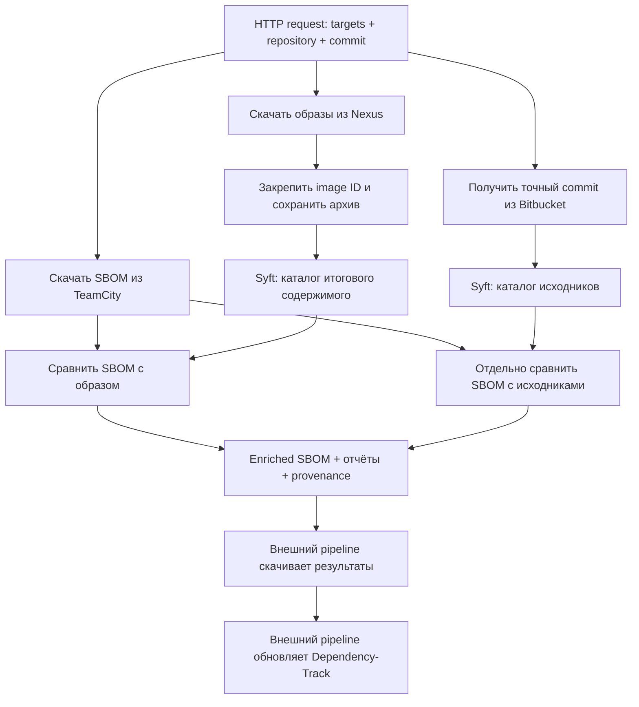

# SCA Accuracy Improvement

Сервис проверяет, насколько CycloneDX SBOM сборки соответствует составу
поставляемых контейнерных образов. Он выявляет пропущенные компоненты,
расхождения версий и зависимости, которые заявлены в SBOM, но не обнаружены
в образе. Результат — обновлённый SBOM с доказательствами и отчёт о расхождениях.

Основное развёртывание — **Linux, внутри инфраструктуры компании**.
На вход по HTTP поступают ссылки на SBOM из TeamCity, образы из Nexus,
HTTPS clone URL репозитория Bitbucket и точный commit.
На выходе сервис выдаёт отдельный enriched SBOM для каждой пары SBOM/образ.
Внешний pipeline затем использует эти файлы для обновления проектов Dependency-Track.

## Зачем нужна система

SBOM, созданный во время сборки, и состав поставки могут различаться:

- зависимость попала в SBOM, но исключена при упаковке приложения;
- в образ вручную добавлена библиотека, отсутствующая в SBOM;
- заявлена одна версия пакета, а поставлена другая;
- базовый образ содержит системные пакеты, не описанные в SBOM приложения.

Сервис делает эти расхождения проверяемыми: сохраняет идентификаторы,
расположение компонентов, способ обнаружения и происхождение входных данных.
Это помогает уточнять инвентаризацию и разбирать findings в Dependency-Track.

**Текущая версия не обещает автоматического сокращения списка уязвимостей.**
Она не удаляет исходные компоненты и не подавляет findings. Если обнаружен
ранее пропущенный пакет, последующий анализ Dependency-Track может найти
дополнительные уязвимости — это тоже повышение точности.

## Как проходит одно задание



1. Проверяются структура запроса, точный hash commit, разрешённые адреса и ссылки.
2. Создаётся изолированный временный checkout. Git получает указанный commit,
   переключается на него и сверяет полученный HEAD с запросом.
3. SBOM скачиваются по прямым HTTPS-ссылкам, для каждого вычисляется SHA-256.
4. Для каждой пары SBOM/образ выполняется pull образа. Изменяемый тег разрешается
   в неизменяемый local image ID, затем именно этот ID передаётся в `docker image save`.
5. Syft анализирует архив образа и исходники. Приложение из образа не запускается.
6. Общее ядро сравнивает идентичности пакетов и записывает результаты.
7. В enriched SBOM добавляется происхождение: репозиторий, commit, URL и SHA-256
   исходного SBOM, image reference и фактически исследованный image ID.
8. После успешного завершения всех пар HTTP API открывает скачивание результатов.
   Временные скачанные SBOM и checkout удаляются; отчёты и evidence сохраняются.

Если любая пара завершилась ошибкой, всё задание получает `failed`, скачивание
его результатов через API заблокировано. Автоматических повторов нет: исправьте
причину и отправьте новое задание. Частичные файлы могут остаться на диске для диагностики.
После рестарта незавершённые задания помечаются как `failed`, завершённые восстанавливаются.

## Кто за что отвечает

| Часть системы | Ответственность |
|---|---|
| TeamCity | Хранит SBOM как артефакты конкретных билдов |
| Bitbucket | Предоставляет Git-репозиторий и точный commit |
| Nexus | Предоставляет контейнерные образы через Docker registry endpoint |
| Syft 1.51.1 | Обнаруживает пакеты, версии, PURL и расположение по metadata |
| Ядро сопоставления | Сравнивает SBOM с каталогом образа и отдельно с каталогом исходников |
| Анализ Java | Дополняет результат статическими JVM-ссылками на методы |
| HTTP-сервис | Получает задание, загружает входы, выполняет анализ, выдаёт файлы |
| Опциональная LLM | Объясняет структурированные расхождения, предлагает гипотезы |
| Внешний pipeline / Dependency-Track | Загружает enriched SBOM, выполняет анализ уязвимостей |

Syft не ищет CVE и не определяет, выполняется ли код библиотеки.
Обнаружение metadata пакета не является проверкой подлинности его байтов.
LLM не принимает решений об удалении компонентов или подавлении уязвимостей.

## Контракт HTTP API

Основной endpoint: `POST /v2/analyses`. Авторизация — Bearer token.
Без настроенного `SCA_API_TOKEN` или `SCA_API_TOKEN_FILE` этот endpoint возвращает 503.
Схема API доступна в `/openapi.json`, интерактивное описание — `/docs`.

Пример тела запроса сохранён в [examples/remote-request.json](examples/remote-request.json):

```json
{
  "repository_url": "https://bitbucket.xxx/scm/team/application.git",
  "commit": "0123456789abcdef0123456789abcdef01234567",
  "targets": [
    {
      "name": "backend",
      "sbom_url": "https://teamcity.xxx/app/rest/builds/id:12345/artifacts/content/backend/sbom.json",
      "images": ["nexus.xxx/team/backend:build-12345"]
    },
    {
      "name": "frontend",
      "sbom_url": "https://teamcity.xxx/app/rest/builds/id:12345/artifacts/content/frontend/sbom.json",
      "images": ["nexus.xxx/team/frontend:build-12345", "nexus.xxx/team/frontend-debug:build-12345"]
    }
  ],
  "with_llm": false
}
```

Замените примерные адреса и commit реальными значениями.

- `repository_url`: прямой HTTPS clone URL. SSH, URL страницы просмотра репозитория,
  credentials в URL, query и fragment не поддерживаются.
- `commit`: полный hash из 40 или 64 hex-символов; имя ветки и короткий hash не принимаются.
- `targets`: от 1 до 16 групп с уникальными именами. В каждой — один SBOM и от 1 до 16 образов.
  Суммарно допускается до 32 пар на задание. Разные репозитории/commits — разные задания.
- `sbom_url`: прямая ссылка на JSON-артефакт, не страница билда и не ZIP-архив.
  Для TeamCity используйте `/app/rest/builds/id:<ID>/artifacts/content/<path>`.
  Формат описан в [документации TeamCity](https://www.jetbrains.com/help/teamcity/rest/manage-finished-builds.html).
- `images`: Docker references с явным tag или digest. Допускается префикс `https://`,
  который нормализуется. URL веб-интерфейса Nexus не подходит.
- `with_llm`: по умолчанию `false`, анализ работает без модели.

Привязка явная: пример создаёт `backend-1`, `frontend-1` и `frontend-2`.
Чужой SBOM автоматически не применяется ко всем образам. Компоненты разных образов
не объединяются в один BOM: это потеряло бы точность границ поставки.

Для воспроизводимости передавайте `nexus.xxx/team/backend@sha256:<64 hex>`.
Тег `latest` допустим, но если он сменился до pull, можно получить другой билд.
Сервис проверяет checkout commit, однако не доказывает, что SBOM и образ построены
именно из этого commit: правильную связь входов обеспечивает вызывающий pipeline.

## Запуск на Linux

На хосте нужны Docker Engine с Compose plugin и доступ к корпоративным серверам.
Git, Docker CLI, Python и закреплённый Syft уже включены в образ сервиса.
PowerShell и локальные Maven/Node/Python-сборщики приложений не нужны.

```bash
mkdir -p workspace secrets certs docker-config
cp .env.example .env
# Настройте .env и секреты по таблице ниже.
docker compose up --build -d
curl --fail http://127.0.0.1:8080/health
```

По умолчанию порт опубликован только на `127.0.0.1:8080`. Для вызовов из других
систем используйте корпоративный HTTPS reverse proxy либо задайте
`SCA_BIND_ADDRESS` адресом нужного интерфейса. Сам процесс слушает HTTP;
TLS входящих запросов завершает reverse proxy. Bearer token обязателен для remote API.

| Настройка | Значение и назначение |
|---|---|
| `SCA_API_TOKEN` / `SCA_API_TOKEN_FILE` | Секрет для вызывающих систем; файл имеет приоритет |
| `SCA_TEAMCITY_HOSTS` | Разрешённые TeamCity `host[:port]`, через запятую |
| `SCA_BITBUCKET_HOSTS` | Разрешённые Bitbucket `host[:port]`, через запятую |
| `SCA_NEXUS_HOSTS` | Разрешённые Docker registry `host[:port]`, через запятую |
| `SCA_TEAMCITY_TOKEN` / `_FILE` | TeamCity Bearer token с доступом к артефактам |
| `SCA_BITBUCKET_TOKEN` / `_FILE` | Bitbucket token, поддерживающий Bearer-доступ к Git over HTTPS |
| `SCA_CA_BUNDLE` | Необязательный путь к PEM bundle для HTTPS TeamCity и Bitbucket |
| `SCA_WORKERS` | Число одновременно выполняемых заданий, по умолчанию 2 |
| `SCA_MAX_SBOM_BYTES` | Максимум одного SBOM, по умолчанию 67108864 байта |
| `SCA_BIND_ADDRESS`, `SCA_PORT` | Интерфейс и порт публикации Compose |

Списки hosts сопоставляются точно, включая нестандартный порт. Wildcards нет.
Для нескольких серверов одного типа текущая конфигурация использует один token.
HTTPS redirects не выполняются. Query-параметры в входных URL запрещены:
используйте прямые артефактные URL и отдельную настройку авторизации.

Пример файлового секрета: положите token в `secrets/teamcity-token`, а в `.env`
укажите `SCA_TEAMCITY_TOKEN_FILE=/run/secrets/teamcity-token`.
Compose монтирует `secrets` и `certs` только для чтения. PEM bundle можно положить
в `certs/company-ca.pem`, указав `SCA_CA_BUNDLE=/run/sca-certs/company-ca.pem`.
TLS-проверка не отключается.

Доступ Nexus использует `docker-config/config.json`, смонтированный в `/run/docker-auth`.
Настройте его через `docker --config ./docker-config login nexus.xxx` либо secret storage.
Если config использует credential helper, этот helper должен быть доступен внутри сервиса.
Доверие к сертификату Nexus настраивается отдельно на Docker daemon хоста.

Сервис использует Docker socket хоста, поэтому размещайте его на выделенном
доверенном Linux worker. Образы после pull остаются в локальном Docker cache.
Результаты в `workspace/results` сохраняются без автоматического удаления;
retention и очистку Docker cache настраивает эксплуатация.

## Отправка задания и получение SBOM

Примеры рассчитаны на Bash, curl и jq. `SCA_SERVICE_URL` — URL сервиса,
`SCA_API_TOKEN` — его token. Не включайте shell tracing для команд с секретами.
Чтобы token не попадал в аргументы curl, используем временный файл заголовка.

```bash
export SCA_SERVICE_URL=http://127.0.0.1:8080
# SCA_API_TOKEN передайте из secret storage.
umask 077
AUTH_HEADER=$(mktemp)
trap 'rm -f "$AUTH_HEADER"' EXIT
printf 'Authorization: Bearer %s\n' "$SCA_API_TOKEN" > "$AUTH_HEADER"

curl --fail --silent --show-error \
  -H @"$AUTH_HEADER" -H 'Content-Type: application/json' \
  --data-binary @examples/remote-request.json \
  "$SCA_SERVICE_URL/v2/analyses" > submitted.json
JOB_ID=$(jq -r '.id' submitted.json)

curl --fail --silent --show-error -H @"$AUTH_HEADER" \
  "$SCA_SERVICE_URL/v2/analyses/$JOB_ID" > status.json
jq '{status, error, result}' status.json
```

POST возвращает HTTP 202, `id`, `status` и `status_url`. Затем вызывающая система
периодически запрашивает статус: `queued` → `running` → `succeeded` или `failed`.
Пример выше показывает один запрос статуса; повторяйте его до конечного состояния.

После `succeeded` скачайте один результат:

```bash
curl --fail --silent --show-error -H @"$AUTH_HEADER" \
  "$SCA_SERVICE_URL/v2/analyses/$JOB_ID/targets/backend-1/artifacts/sbom.enriched.json" \
  -o backend.sbom.enriched.json
```

Список результатов находится в `result.targets`. Поле `sbom_artifact` содержит
относительный путь после `/v2/analyses/<job_id>/`, поэтому вызывающая система
может скачать все файлы без угадывания их имён.

| HTTP-ответ | Значение |
|---|---|
| 202 | Задание принято |
| 401 | Неверная или отсутствующая авторизация |
| 422 | Неверный входной контракт или запрещённый host |
| 503 | Remote API выключен: token сервиса не настроен |
| 409 при скачивании | Задание ещё не завершилось успешно |
| 404 при скачивании | Неизвестное задание, результат или имя файла |

Ошибки скачивания, Git, registry или сканирования после приёма запроса отображаются
как `status: failed` и поле `error`. Клиенту недостаточно проверить только HTTP 202.

## Что именно сравнивается

Общий ключ — Package URL: экосистема, namespace, имя, версия и qualifiers.
Одноимённые npm- и Python-пакеты считаются разными компонентами. Maven `type=jar`
нормализуется к значению по умолчанию, значимые qualifiers сохраняются.

| Статус | Интерпретация |
|---|---|
| `confirmed_present` | Совпадающие пакетные metadata обнаружены в образе |
| `version_conflict` | Обнаружен тот же пакет другой версии |
| `observed_not_declared` | Пакет обнаружен, но не заявлен в SBOM |
| `unexpected_absent` | Заявлен, но не обнаружен; отсутствие не доказано |
| `expected_absent` | Не обнаружен, и отдельно предоставленный Maven scope объясняет ожидание |
| `identity_uncertain` | Недостаточная или некорректная идентификация |

Пример: в SBOM указан `slf4j-api:2.0.13`, а в образе найден `2.0.16`.
Система выдаёт `version_conflict` и записывает наблюдённую версию как аннотацию.
Исходную версию автоматически не заменяет. Для нового, ранее незаявленного
пакета добавляется отдельный компонент. Исходные компоненты не удаляются.

SBOM ↔ образ и SBOM ↔ исходники — два отдельных сравнения. Полная цепочка
«декларация → resolution сборки → упаковка → поставленный файл» пока не восстанавливается.
Каталог исходников не доказывает наличие пакета в поставке или совпадение условий билда.

## Экосистемы и ограничения обнаружения

| Экосистема | Основные свидетельства |
|---|---|
| Java / Maven / Gradle | JAR/WAR, Maven metadata, дополнительные JVM static references |
| JavaScript / TypeScript | npm package metadata и поддерживаемые lockfiles |
| Python | dist-info/egg-info, requirements и поддерживаемые lockfiles |
| .NET | NuGet metadata, deps.json и поддерживаемые project/lockfiles |
| Go | build info в бинарниках, go.mod |
| Rust | Cargo.lock, поддерживаемые auditable binaries |
| PHP / Ruby | Composer installed/lock, gemspec/Gemfile.lock |
| Системные пакеты | APK, DEB, RPM databases |

Форматы зависят от [каталогизаторов Syft](https://oss.anchore.com/docs/capabilities/all-packages/).
Список экосистем не означает поддержку каждой возможной упаковки.
Bundling, shading, vendoring, обфускация и stripped binaries могут скрывать пакеты.

Исходники читаются пассивно: без Maven/npm/pip install и запуска сборки.
Git hooks и submodules не выполняются/не загружаются, LFS-объекты не скачиваются.
Checkout с симлинком за пределы репозитория отклоняется.
`dependency-tree.json` автоматически не создаётся; локальный CLI может принять
его как дополнительное Maven evidence. В remote API он не требуется и не передаётся.

Для Java извлекаются статические ссылки на методы из байткода. Такая ссылка не
доказывает runtime execution или эксплуатацию. Отсутствие ссылки не доказывает
недостижимость из-за reflection, DI и динамической загрузки.
Полного анализа достижимости для всех экосистем сейчас нет.

## Выходные файлы

В каждой паре доступны через `/targets/<target_id>/artifacts/<filename>`:

| Файл | Назначение |
|---|---|
| `sbom.enriched.json` | Основной результат для внешней загрузки в Dependency-Track |
| `assessment.json` | Статусы сравнения SBOM с образом |
| `source-assessment.json` | Отдельное сравнение с исходниками |
| `inventory.json` | Наблюдения и расположение пакетов |
| `coverage.json` | Версия сканера, наблюдённые типы пакетов, ограничения |
| `provenance.json` | Commit, источники входов, SHA-256 SBOM и image ID |
| `report.html` | Автономный HTML-отчёт |

На диске также сохраняются `evidence/image.syft.json` и `evidence/source.syft.json`.
Они не опубликованы в списке разрешённых HTTP-артефактов.
`manifest.json` на уровне задания соответствует результату, возвращаемому API.

## Dependency-Track и VEX

Remote API **не обращается к Dependency-Track** и не требует его credentials.
Внешняя система выбирает проект/version, скачивает соответствующий enriched SBOM
и загружает его. При нескольких образах не следует бездумно загружать разные BOM
в один project/version: правила их хранения и замены определяет ваша интеграция.

Отдельный CLI `sca-accuracy-dtrack` сохранён для ручных и pipeline-операций:
экспорт VDR, загрузка BOM, ожидание обработки, передача VEX. Он не входит
в обязательный путь нового remote API. Пример загрузки:

```bash
# DEPENDENCY_TRACK_URL и DEPENDENCY_TRACK_API_KEY заданы в окружении.
uv run sca-accuracy-dtrack upload-bom --project "$DTRACK_PROJECT_UUID" \
  --file backend.sbom.enriched.json
```

Локальный CLI также умеет принимать VDR с findings и выпускать VEX.
Оба режима VEX (`advisory`, `safe`) оставляют решения в `in_triage`.
Отсутствие пакета, Maven test scope и static references не используются для
автоматического `not_affected` или `exploitable`. Remote API без VDR VEX не создаёт.

## Опциональная модель

По умолчанию внешних вызовов LLM нет. При `with_llm: true` модель получает
структурированные расхождения, сведения об исходниках и ограничения анализа.
Архив образа и полный исходный код напрямую не отправляются; имена пакетов,
пути и другие сведения отчёта входят в запрос. Ответ содержит объяснение,
гипотезы и недостающие доказательства и не меняет статусы компонентов.

Для текущей API-конфигурации используются `DEEPSEEK_API_KEY` либо `SCA_LLM_API_KEY`,
`SCA_LLM_BASE_URL` и `SCA_LLM_MODEL`. Для полностью on-prem режима задайте локальный
OpenAI-compatible endpoint либо оставьте `with_llm: false`. Ошибка включённой
модели сейчас завершает анализ ошибкой; автоматического fallback нет.

## Разработка и проверки

```bash
uv sync --extra dev
uv run ruff format --check .
uv run ruff check .
uv run pytest -q
uv build
uv run python golden/build.py
uv run python golden/universal/verify.py
```

Для HTTPS integration tests нужен OpenSSL; на Linux он обычно устанавливается
пакетом `openssl`. Для golden-сценариев нужны Docker и Syft (или `SCA_SYFT_BINARY`).
[Java golden](golden/README.md) проверяет настоящий Maven/CycloneDX/Spring Boot билд.
Смешанный fixture проверяет metadata шести экосистем образа и шести экосистем исходников.
Это проверка распознавания состава, не эксплуатации уязвимостей.

API v1 с локальными путями и локальный CLI сохранены для диагностики и совместимости.
Новые интеграции должны использовать v2 с удалёнными входами.
Подробности: [архитектура](docs/architecture.md), [интеграция](integrations/README.md),
[границы доступа](SECURITY.md).
