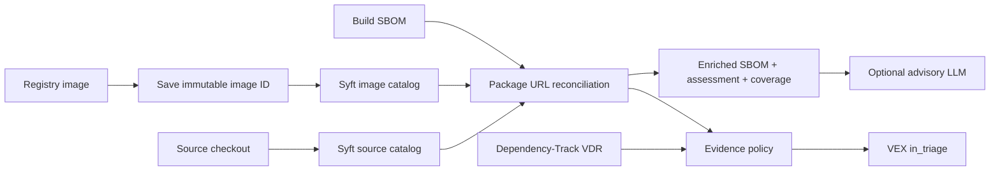

# Универсальный MVP

Образ не запускается. Checkout даёт декларации, образ — свидетельства поставки.
Maven tree принимается опционально, не генерируется. Scope не универсален.
Package URL нормализуется с сохранением экосистемы и qualifiers; Maven type=jar
нормализуется к умолчанию. Ошибка сканера завершает задание ошибкой.
Syft закреплён в Dockerfile по версии/digest. Исходный JSON сохраняется как evidence.
LLM не меняет статусы. Runtime reachability и условия оригинальной сборки неизвестны.
