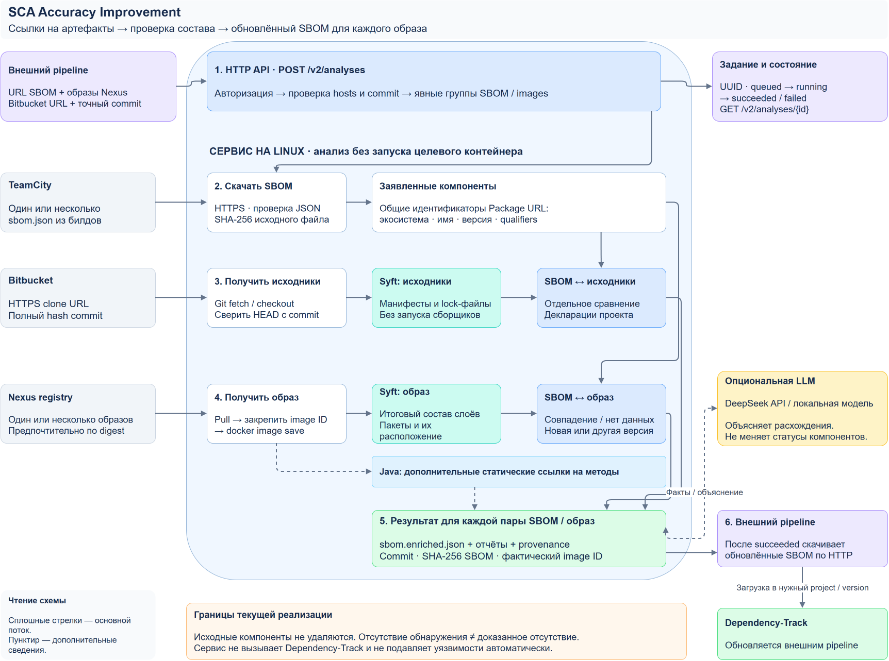

# Архитектура сервиса

Сервис состоит из HTTP-слоя, загрузчиков удалённых входов и ядра анализа.
Главный результат — отдельный enriched CycloneDX SBOM для каждой пары SBOM/образ.

[Редактируемая схема draw.io](diagrams/system-workflow.drawio) ·
[PNG в полном размере](diagrams/system-workflow.png)

## Постоянное хранилище evidence

После анализа сервис записывает исходные и выходные документы в PostgreSQL и
каталог файлов по SHA-256. Remote API сохраняет результат после добавления
repository/commit/build-artifact provenance. Результат содержит `evidence_id`.
`/v2/evidence` предоставляет поиск, получение оригинальных файлов с проверкой хеша
и добавление разметки. Синтетические результаты отделены от production-наблюдений.
История не подмешивается в запрос модели автоматически; факты, решения модели
и ручные подтверждения остаются разными сущностями. Подробности: [evidence](evidence.md).

## Входной контракт API

`RemoteAnalysisRequest` содержит один repository/commit и несколько `BuildTarget`.
В группе одна ссылка SBOM и несколько образов. Такое соответствие задано явно;
между разными группами не строится декартово произведение. Максимум 32 пары.

`remote.py` проверяет разрешённые hosts, скачивает SBOM, получает Git commit,
запускает анализ пар и формирует `manifest.json`. В enriched SBOM записывается
provenance. Исходные checkout и скачанные JSON хранятся во временном каталоге задания.

## Выполнение

`service.py` создаёт UUID задания и сохраняет `job.json` на диске. ThreadPoolExecutor
выполняет до SCA_WORKERS заданий одновременно; пары внутри одного задания идут
последовательно. Очередь в процессе не имеет отдельной квоты, поэтому ограничение
частоты запросов и размера HTTP body следует задать на reverse proxy.
Это один экземпляр сервиса с локальным хранилищем, не распределённая очередь.

Статусы: queued, running, succeeded, failed. После рестарта незавершённая работа
помечается failed, а не автоматически повторяется. Результаты доступны через API
только после успеха всего задания. Каталогизация одного checkout сейчас повторяется
для каждой пары; общего межзадачного кэша нет.

## Анализ и evidence

`catalog.py` сохраняет образ по закреплённому local image ID и запускает Syft
над squashed filesystem archive. Целевой контейнер не запускается. Исходники
каталогизируются без build/install. Syft закреплён в Dockerfile по версии/digest;
его update check и Java network enrichment отключены. Ошибка или timeout сканера
завершает анализ ошибкой, а не превращается в пустой успешный каталог.

`sbom.py` нормализует Package URL и сравнивает имена/версии/qualifiers.
Сравнение SBOM с образом и исходниками выполняется отдельно. Исходный BOM
сохраняется, дополняется статусами и новыми компонентами. Найденная конфликтующая
версия записывается в аннотации. Модель может разрешить замену только при однозначной связи по SHA-256; без неё исходная версия сохраняется.

`image.py` дополнительно извлекает статические JVM-ссылки. Они не являются
полным call graph или доказательством исполнения. При with_llm=true модель выбирает кандидатов add/replace_identity; decisions.py повторно проверяет evidence и применяет допустимый план до enrich_sbom(). Журнал — decisions.json. Необнаружение не разрешает удаление.
Remote API не загружает VDR и не вызывает Dependency-Track. Локальный CLI может
обрабатывать VDR и выпускать VEX, все решения текущей policy остаются in_triage.

## Границы доверия

Входные HTTPS URL принимаются только для явно разрешённых host[:port].
Redirects выключены, credentials в URL не принимаются. TeamCity и Bitbucket
используют серверные Bearer credentials и проверку TLS. Git работает без
пользовательской/системной конфигурации, hooks, submodules и LFS downloading.
Нужный commit проверяется после fetch/checkout. Внешние симлинки отклоняются.

Docker registry access использует отдельный Docker config; доверие Nexus CA
настраивается на Docker daemon. Доступ к socket требует выделенного доверенного
worker. Контейнер сервиса не следует считать sandbox от Docker host.

Связь «SBOM и образ построены из указанного commit» утверждает вызывающий pipeline.
Сервис сохраняет эти входы, но не проверяет build attestations. Автоматическое
удаление findings или пересчёт критичности не реализованы.
